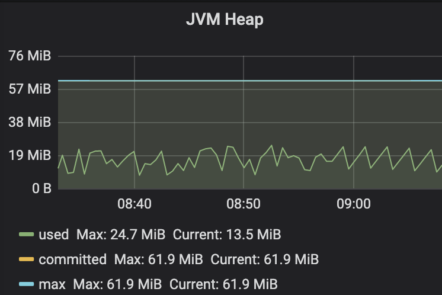
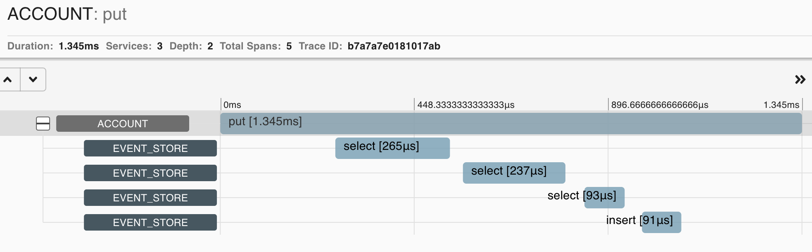

## Event Sourced Account

[](https://github.com/rieske/event-sourced-account/actions)
[](https://codeclimate.com/github/rieske/event-sourced-account/maintainability)
[](https://coveralls.io/github/rieske/event-sourced-account?branch=master)

A lightweight, frameworkless event sourced Account implementation.


### Implementation

The purpose of this project was for myself to better understand the complexities of event sourcing
and apply the lessons learned from hype-driven event sourcing implementations gone wrong.

The service is test-driven bottom-up: domain -> event sourcing -> public API.

#### Domain
Four operations can be performed on an account - open, deposit, withdraw, and close.
Domain captures the business rules of when an account can be interacted with, what amounts
can be deposited and withdrawn and under what circumstances.
Money transfer between accounts is a withdrawal from one account and deposit to
another that has to happen within a transaction - either both operations succeed or none.

#### Event sourcing
In essence, event sourcing is a data storage technique when the state is stored as a sequence of
domain events as opposed to storing the final state.
It comes with some beneficial side effects, most prominently pronounced ones being:
 - the "free" audit log recorded by the events.
In reality, nothing is free, and the cost here is complexity, especially when the software evolves, and the amount of stored data grows.
Yes, hard drives are cheap, and you can store insane amounts of data.
It is managing and working with the insane amounts of continuously growing data that becomes complex.
 - the ability to build different read-optimized projections of the data for different use cases using a pattern like CQRS.
 - potential to emit certain external events for other systems to react to.
Beware: never expose/publish the internal domain events used for event sourcing to an external system.
Do not make the internal events your public API.
If you do, all your domain implementation details and the persistence layer will become your public contract.
This is the same evil as sharing a regular flat database schema between multiple services.

In our case, the most important aspect of event sourcing is the optimistic locking that it enables that can help to
ensure consistency of the data in a distributed environment, enabling horizontal scalability of the service.

#### Concurrency
The event store here is key to ensuring consistency in a multithreaded environment.
Specifically, the constraints that the database provides - remove the (aggregateId, sequenceNumber)
primary key and all but consistency tests will pass.

The trick is to read the state of an account first, compute the events to be applied and insert them within a single transaction.
Upon reading the current state, we know the sequenceNumber of the last event. It gets incremented by one for each subsequent event
that we plan to insert. If some other client inserts an event first, then the constraint will reject our transaction, and we will have
to re-read the current state and retry.

Service behavior in a distributed environment is tested at multiple layers:
- an in-memory event store, H2, and a real database container when multiple threads hammer a single account
- multiple clients hammering an account via a load balancer through two instances of the service connecting to a database

#### Idempotency
What can be important when dealing with money and especially when requests come over an
unreliable network (and the network is unreliable by definition) is idempotency. When a client
request gets interrupted due to whatever reason, the client might not know whether the
request was handled or not and might retry. This might result in a double transfer, double
deposit or withdrawal had the original request been handled successfully. To prevent such
cases, the client should supply a unique transaction id (a UUID in our case) for each
distinct operation. This id is persisted, and in case a duplicate request comes in, it will
be accepted, but no action will be taken since we know we already handled it.
Transaction ids can not be reused. The current implementation is a bit naive as it does not take into account
the type of operation in the context of idempotency, just the transaction id together with
affected account id, meaning that given a transaction id that was used for a deposit
would be used for a withdrawal, the service would respond that it accepted the request.
Maybe a better way would be to conflict in such cases.


### API

- open account: `POST /api/account/{accountId}?owner={ownerId}` should respond with `201`
  and a `Location` header pointing to the created resource if successful
- get account's current state: `GET /api/account/{accountId}` should respond with `200`
  and a json body if account is found, otherwise `404`
- deposit: `PUT /api/account/{accountId}?deposit={amount}&transactionId={uuid}`
  should respond with `204` if successful
- withdraw: `PUT /api/account/{accountId}?withdraw={amount}&transactionId={uuid}`
  should respond with `204` if successful
- transfer: `PUT /api/account/{accountId}?transfer={targetAccountId}&amount={amount}&transactionId={uuid}`
  should respond with `204` if successful
- close account: `DELETE /api/account/{accountId}` should respond with `204` if successful


### Tests

Tests are separated in their own source sets and given their own Gradle task by test category.
Tests in the `test` source set and executed by `test` task are the fast unit tests.

The next level are the integration tests that use both Postgres and Mysql backed event store implementations.
They use testcontainers to spawn real database instances. Integration tests live in `integrationTest` source
set and are executed using `integrationTest` task.

Finally, a couple of end-to-end tests that focus mainly on sanity testing consistency in a distributed
environment. `e2eTest` source set and a task with the same name.

Since I was test driving this service from the domain up to the event sourcing infrastructure and lastly
up to the API, some of the tests might be redundant and functionality might be tested several times.
With the in-memory event store and h2 event store, the unit tests exercise the whole module really fast
, and it might even be possible to move the remaining lower-level tests higher up. This would allow
us to test the functionality solely via the API and not have any implementation details tests.
Which can, in turn, make changes to internal implementation details easier to make with the absence of
implementation-oriented tests. I did not use any mocking framework to avoid testing implementation
and focus solely on the functionality.


### Potential red flags

- I used longs for monetary amounts, assuming those are in minor units/cents. I am aware that money
is a delicate matter, and extra care is needed when dealing with it in software. Since
this service performs only basic addition and subtraction, I decided to use cents for now
and focus on other things. Should I need to deal with floating points, I would at the very
least go for BigDecimal and probably do some investigation around current best practices -
I know there is a javamoney implementation, also an older joda money one.

- I did not take currency into account - all accounts are the same currency for now. Should I
need to add currency, I'd probably have to refine the type that holds amounts to include
the currency, prevent deposits/withdrawals if the account currency does not match. This would
prevent cross-currency transfers right away. Currency conversion for cross currency transfers
is something I'd have to figure out. This potentially could be out of scope for accounts
service itself.

- Exception types in the domain - probably would make sense to create specific types for
InsufficientBalance, AccountClosed exceptions etc. Kept it simple with IllegalArgument/State
exceptions for the sake of avoiding unneeded class count explosion.

### Building

```shell script
./gradlew test
```

The test task will only run the fast unit tests (including event store tests with H2 in postgres mode).

In order to run the same set of tests targeting Postgres and Mysql, run
```shell script
./gradlew integrationTest
```
Those will be much slower - they spawn the actual Postgres and Mysql instances using testcontainers and thus
require a running docker daemon.

And another round of slow tests that test for consistency in a distributed environment:
```shell script
./gradlew e2eTest
```
Those will spawn a docker-composed environment with two service instances connected to
a postgres container and a load balancer on top. Tests will be executed against the load balancer,
simulating a distributed environment, and asserting that the service can scale and remain consistent.

To run the full suite, run:
```shell script
./gradlew check
```

### Running

The service can be spawned in a minimal production-like environment using `docker compose`.
The environment consists of two service instances packaged in a docker container, connected to a Postgres container, and
exposed via Envoy Proxy. A minimal monitoring setup is available, as well.

To start:
```shell script
./gradlew composeUp
```
The service will be accessible on localhost:8080 and requests
will go via a load balancer to two service instances in a round-robin fashion.

To stop:
```shell script
./gradlew composeDown
```

### Monitoring

Tracing instrumentation with Zipkin is provided if the service is started with ZIPKIN_URL environment
variable set. It is preconfigured in the composed environment.
Basic metrics are exposed to Prometheus and sample configuration of Prometheus together with
Grafana and a service/envoy dashboards can be accessed by spawning a composed environment using
```shell script
./gradlew composeUp
```
Prometheus is exposed on port 9090.

Grafana is available on port 3000. Dashboards are available for basic service metrics, JVM metrics, and Envoy metrics.
It is pretty cool to see how light the service is even when stressed:


Zipkin on port 9411.


